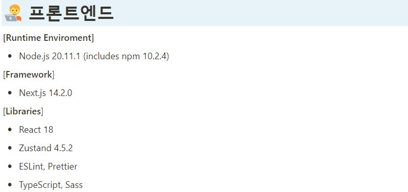
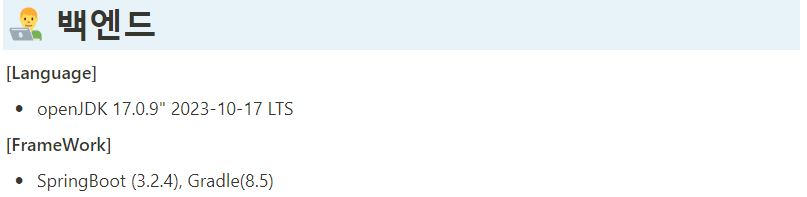
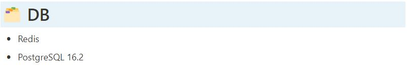
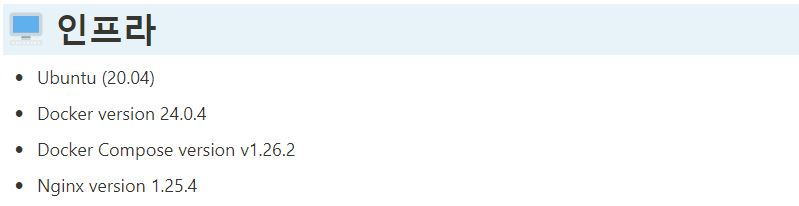
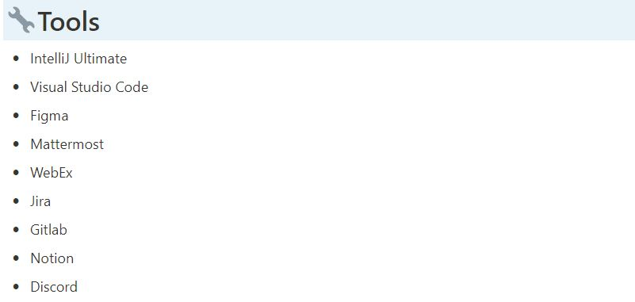
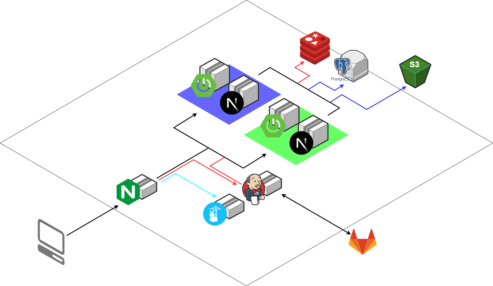

#  Sanyang Portpolio

일러스트레이터 Sanyang님의 개인 포트폴리오 사이트 제작 프로젝트입니다.

**프로젝트의 링크는 [🔗sanyang.me](https://sanyang.me)에서 확인 가능합니다.**

<br>

## 👦 팀원

### 프로젝트 팀 구성 및 역할

| 기술스택              | 이름   | 역할                                                                                       |
| --------------------- | ------ | ------------------------------------------------------------------------------------------ |
| **FE**                | 남찬현 | - 애플리케이션의 상태 관리 및 비즈니스 로직 구현 <br> - UI/UX 디자인 |
| **FE**                | 오철수 |                                                                                            |
| **FE**, <br>**INFRA** | 조영진 | - EC2 서버를 활용한 서비스 배포 <br> - BLUE/GREEN을 활용한 무중단 배포 <br> - UI/UX 디자인 |
| **BE**                | 김태희 |                                                                                            |
| **BE**                | 임혜령 |                                                                                            |
| **BE**                | 박예원 |                                                                                            |

<br>

## 🚩 시작하기

[🔗포팅메뉴얼](exec/B105_CanvEarth_포팅매뉴얼.pdf) 이동

<br>

## 📅 시연 시나리오

[🔗시연 시나리오](exec/10기_자율PJT_시연시나리오_B105.pdf) 이동

<br>

## 🧰 기술 스택

#### Front-End



#### Back-End



#### DB



#### INFRA



#### TOOL



<br>

## 📦 프로젝트 구조

#### 아키텍쳐



#### 프론트엔드 파일구조

```
FRONT-END
├─build
├─public
│  ├─brand
│  ├─fonts
│  └─svgs
└─src
    ├─app
    │  ├─(home)
    │  ├─gallery
    │  ├─inquire
    │  ├─notification
    │  ├─outsourcing
    │  ├─personal
    │  └─support
    ├─component
    │  ├─banner
    │  ├─layout
    │  └─support
    └─utils
        ├─api
        │  └─DTO
        └─store
```

#### 백엔드 파일구조

```
BACK-END
└─canvEarth
    ├─gradle
    │  └─wrapper
    └─src
        ├─main
        │  ├─java
        │  │  └─com
        │  │      └─b301
        │  │          └─canvearth
        │  │              ├─domain
        │  │              │  ├─admin
        │  │              │  │  ├─controller
        │  │              │  │  └─dto
        │  │              │  │      ├─request
        │  │              │  │      └─response
        │  │              │  ├─authorization
        │  │              │  │  ├─dto
        │  │              │  │  └─service
        │  │              │  ├─banner
        │  │              │  │  ├─controller
        │  │              │  │  ├─dto
        │  │              │  │  ├─entity
        │  │              │  │  ├─repository
        │  │              │  │  └─service
        │  │              │  ├─calendar
        │  │              │  │  ├─controller
        │  │              │  │  ├─dto
        │  │              │  │  ├─entity
        │  │              │  │  ├─repository
        │  │              │  │  └─service
        │  │              │  ├─embed
        │  │              │  │  ├─controller
        │  │              │  │  ├─dto
        │  │              │  │  ├─entity
        │  │              │  │  ├─repository
        │  │              │  │  └─service
        │  │              │  ├─gallery
        │  │              │  │  ├─controller
        │  │              │  │  ├─dto
        │  │              │  │  ├─entity
        │  │              │  │  ├─repository
        │  │              │  │  └─service
        │  │              │  ├─notice
        │  │              │  │  ├─controller
        │  │              │  │  ├─dto
        │  │              │  │  ├─entity
        │  │              │  │  ├─repository
        │  │              │  │  └─service
        │  │              │  ├─s3
        │  │              │  │  └─service
        │  │              │  ├─support
        │  │              │  │  ├─controller
        │  │              │  │  ├─dto
        │  │              │  │  ├─entity
        │  │              │  │  ├─repository
        │  │              │  │  └─service
        │  │              │  ├─user
        │  │              │  │  ├─controller
        │  │              │  │  ├─dto
        │  │              │  │  ├─entity
        │  │              │  │  ├─repository
        │  │              │  │  └─service
        │  │              │  └─work
        │  │              │      ├─controller
        │  │              │      ├─dto
        │  │              │      ├─entity
        │  │              │      ├─repository
        │  │              │      └─service
        │  │              └─global
        │  │                  ├─config
        │  │                  ├─error
        │  │                  ├─filter
        │  │                  ├─handler
        │  │                  └─util
        │  └─resources
        └─test
            └─java
                └─com
                    └─b301
                        └─canvearth
```
